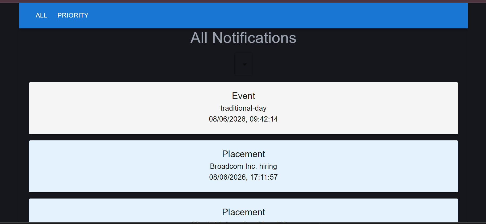
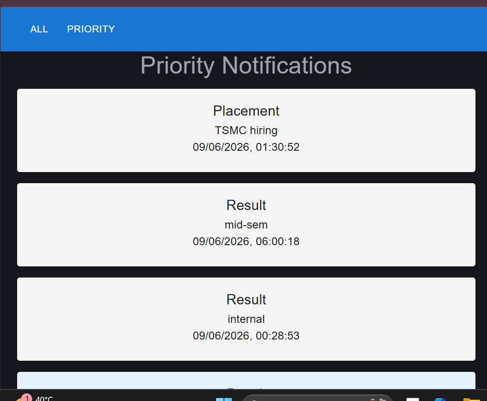
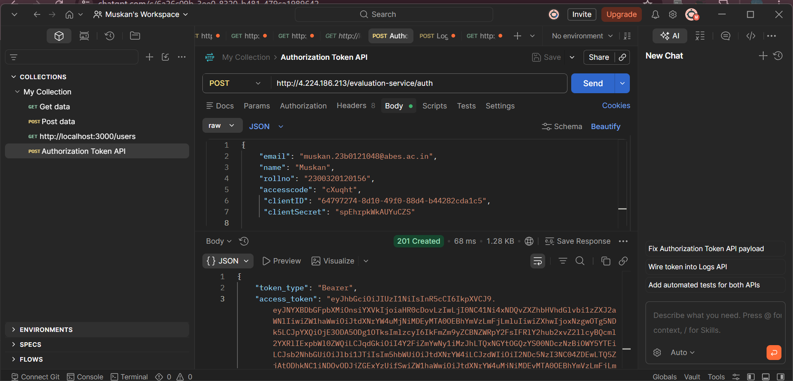

# Notification Application

A React-based notification viewer developed as part of the Affordmed Campus Evaluation.

## Features

- View all notifications
- View priority notifications
- Notification type filtering
- Authentication token generation
- Material UI based interface
- API integration with evaluation service

---

---

## Screenshots

### All Notifications

---

### Priority Notifications

---

### Authentication Token Generation

---

## Technology Stack

- React
- Vite
- JavaScript
- Material UI
- REST APIs

---

## Author

**Muskan Yadav**

Roll No: 2300320120156

ABES Engineering College
